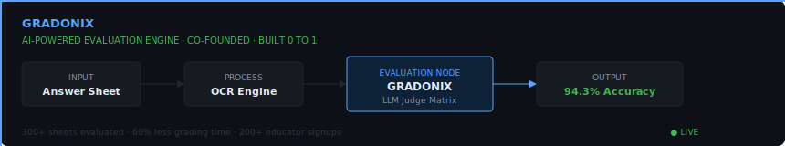

  

 

---

## `$ whoami`

CS undergrad at **BITS Pilani** (CGPA 9.22) based in Bangalore. I build things end-to-end - from parsing pipelines and vector databases to product UIs and APIs. My focus is full-stack engineering with a strong pull towards AI systems: RAG pipelines, LLM evaluation, and production-grade ML infrastructure.

Not here to build demos. Here to ship.

 

---

## `$ cat stack.json`

<table align="center" width="100%">
  <tr>
    <td align="center" valign="top" width="20%">
       
      &nbsp;
      &nbsp;
      &nbsp;
      &nbsp;
      &nbsp;
      
       <b>LANGUAGES</b>  
    </td>
    <td align="center" valign="top" width="20%">
       
      &nbsp;
      &nbsp;
      &nbsp;
      &nbsp;
      &nbsp;
      
       <b>MERN + FRAMEWORKS</b>  
    </td>
    <td align="center" valign="top" width="20%">
       
      &nbsp;
      &nbsp;
      &nbsp;
      &nbsp;
      &nbsp;
      
       <b>INFRA & DATABASES</b>  
    </td>
    <td align="center" valign="top" width="25%">
       
      
      
      
      
      
      
       <b>AI / ML & DESIGN</b>  
    </td>
  </tr>
</table>

 

---

## `$ ls -la ./projects`

### ⬡ Gradonix - LLM Exam Evaluation Engine

OCR plus LLM-based answer scoring pipeline built from scratch. Achieved 94.3% agreement with human evaluators across 300+ answer sheets - 60% faster than manual grading. Designed full product UX in Figma, ran usability testing with 20+ educators, drove outreach to 200+ registrations.

  

**Pipeline:** Answer Sheet Scan → OCR + PDF Parse → LLM Judge Matrix → Grade Report

**Stack:** Python · OCR · LLM APIs · Figma · FastAPI

---

### ⬡ Recruitify - AI Recruitment Platform

Built the PDF parsing and async batch resume upload pipeline for a 5-person team. Semantic candidate ranking via pgvector embeddings. Integrated LLM-based bias detection in job descriptions. Caught and rolled back unauthorized file changes introduced by an AI coding agent mid-sprint.

  

**Pipeline:** Resume Upload → OCR/Parse → Embed → Rank → Bias Flag → Interview Scheduling

**Stack:** FastAPI · PostgreSQL (pgvector) · Next.js · Google Gemini · pdfplumber

---

### ⬡ DocuMind - NotebookLM Clone with RAG + Voice

Document-grounded AI assistant that grounds every answer in your source material with accurate citations. Supports PDF, audio, YouTube, web pages, and text. Migrated the full stack from OpenAI to open-source alternatives (Groq Llama 3.3 70B + BAAI Embeddings + Milvus Lite) with zero performance loss. Multi-session memory via Zep temporal knowledge graphs. Includes AI podcast generation with multi-speaker TTS. Runs at zero API cost.

  

**Stack:** Groq (Llama 3.3 70B) · BAAI Embeddings · Milvus Lite · Zep Cloud · Streamlit

`ZERO API COST` &nbsp; `RAG + VOICE + AUDIO`

 

---

## `$ git log --stat`

  
  &nbsp;
  

 

  

 

---

## `$ ping anushka.build`

| Interface | Endpoint | Status |
| :--- | :--- | :--- |
| 🌐 **Portfolio** | [anushka.build](#) *(coming soon)* | `BUILDING` |
| 💼 **LinkedIn** | [linkedin.com/in/anushka-jainn](https://linkedin.com/in/anushka-jainn) | `ACTIVE` |
| 💻 **GitHub** | [github.com/anushkabhansalii](https://github.com/anushkabhansalii) | `ACTIVE` |
| 📧 **Email** | anushkaj460@gmail.com | `OPEN` |

 

---

> `[LOG]` *"I don't build to learn. I learn because I have to ship."*

  BITS PILANI · FULL STACK · AI/ML · BANGALORE // STATUS: BUILDING

