<div align="center">
  
</div>

<br />

---

## `>_ WHAT I BUILD`

I'm a Computer Science student at **BITS Pilani** (CGPA: 9.22) who builds real AI systems — not tutorials, not wrappers. I've co-founded a startup, shipped evaluation pipelines that rival human accuracy, and worked across product, growth, and engineering at companies like Emergent and Canvas & Co.

My focus right now: **LLM evaluation infrastructure**, **RAG systems**, and **full-stack AI products** that actually work in production.

- 🎓 **BITS Pilani** — B.Sc. Computer Science, Class of 2028
- 🏗 **Co-Founder** @ Gradonix — AI-powered exam evaluation
- 📍 **Bangalore, IN** → Pilani, IN

<br />

---

## `>_ STACK`

<table align="center" width="100%">
  <tr>
    <td align="center" valign="top">
      <b>AI / ML</b><br  />
      PyTorch · scikit-learn<br/>
      LLM APIs (Groq, Gemini, OpenAI)<br/>
      RAG Pipelines · OCR<br/>
      pgvector · BAAI Embeddings<br/>
      Grad-CAM · NumPy · pandas
    </td>
    <td align="center" valign="top">
      <b>LANGUAGES</b><br  />
      Python · JavaScript<br/>
      SQL (PostgreSQL)<br/>
      Java · C++<br/>
      HTML / CSS
    </td>
    <td align="center" valign="top">
      <b>BACKEND & INFRA</b><br  />
      FastAPI · Node.js<br/>
      PostgreSQL · Milvus<br/>
      Docker · Git · Linux<br/>
      Google Cloud Platform
    </td>
    <td align="center" valign="top">
      <b>FRONTEND & DESIGN</b><br  />
      React · Streamlit<br/>
      Figma<br/>
      HTML / CSS
    </td>
  </tr>
</table>

<br />

---

## `>_ SHIPPED PROJECTS`

### ⬡ **Gradonix** — AI Exam Evaluation Engine

Co-founded. Architected the full OCR + LLM scoring pipeline end-to-end. 94.3% agreement with human evaluators across 300+ answer sheets. 60% reduction in grading time. 200+ educator registrations.

<div align="center">
  
</div>

**`[FULL PIPELINE]`** Answer Sheet Scan → OCR + PDF Parse → LLM Judge Matrix → Grade + Report

**Key work:** Built the core scoring model, designed full product UI/UX in Figma, ran usability testing with 20+ educators, drove outreach.

`STEALTH MODE` · `CO-FOUNDED`

---

### ⬡ **Recruitify** — AI Recruitment Platform

Built the PDF parsing and async batch resume upload pipeline. Implemented semantic candidate ranking via pgvector embeddings. Integrated LLM-based bias detection in job descriptions. Caught and rolled back unauthorized file changes introduced by an AI coding agent mid-sprint.

<div align="center">
  
</div>

**`[FULL PIPELINE]`** Resume Upload → OCR/Parse → Embed → Rank → Bias Flag → Interview Scheduling

**Stack:** FastAPI · PostgreSQL (pgvector) · Next.js · Google Gemini · pdfplumber

`5-PERSON TEAM` · `DEPLOYED`

---

### ⬡ **NotebookLM Clone** — Zero-Cost RAG System

Production-grade local RAG system for document Q&A. Migrated entire stack from OpenAI to free open-source alternatives — Groq (Llama 3.3 70B) + BAAI Embeddings + Milvus Lite — with no performance degradation. Multi-session memory via Zep Cloud. Runs at zero API cost.

<div align="center">
  
</div>

**Stack:** Groq (Llama 3.3 70B) · BAAI Embeddings · Milvus Lite · Zep Cloud · Streamlit

`ZERO API COST` · `PRODUCTION GRADE`

<br />

---

## `>_ EXPERIENCE TRAIL`

| Timeline | Role | Where |
| :--- | :--- | :--- |
| **2025** | Co-Founder | Gradonix |
| **May – July 2025** | Product & Growth Intern | Emergent |
| **Nov 2025** | Content & Growth Intern | InterviewBit (Scaler) |
| **Dec 2025** | Research & Concept Intern | Canvas & Co. |

<br />

---

## `>_ NUMBERS`

```
94.3%  →  scoring agreement with human evaluators (Gradonix)
 200+  →  educator registrations on first push
  60%  →  reduction in grading time
   5x  →  zero API cost migration (NotebookLM Clone)
73000  →  organic impressions generated (Scaler content sprint)
```

<br />

---

## `>_ CONNECT`

| Interface | Address | Status |
| :--- | :--- | :--- |
| 💼 **LinkedIn** | [anushka-jainn](https://linkedin.com/in/anushka-jainn) | `ACTIVE` |
| 💻 **GitHub** | [anushkabhansalii](https://github.com/anushkabhansalii) | `ACTIVE` |
| 📧 **Email** | anushkaj460@gmail.com | `OPEN` |

<br />

---

> `[LOG]` *"I don't build to learn. I learn because I have to ship."*

<div align="center">
  <sub>BITS PILANI · AI/ML · FULL STACK · CO-FOUNDER // STATUS: BUILDING</sub>
</div>
